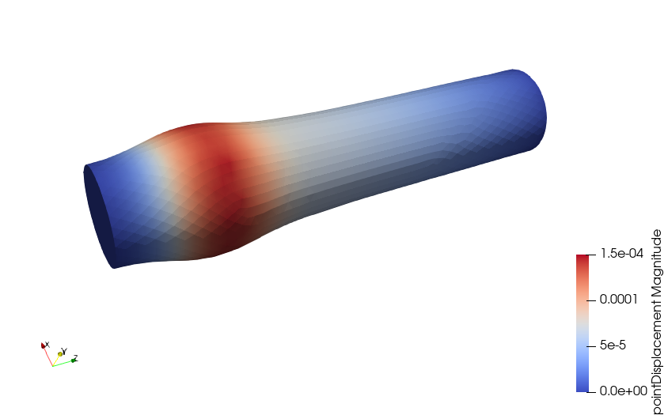
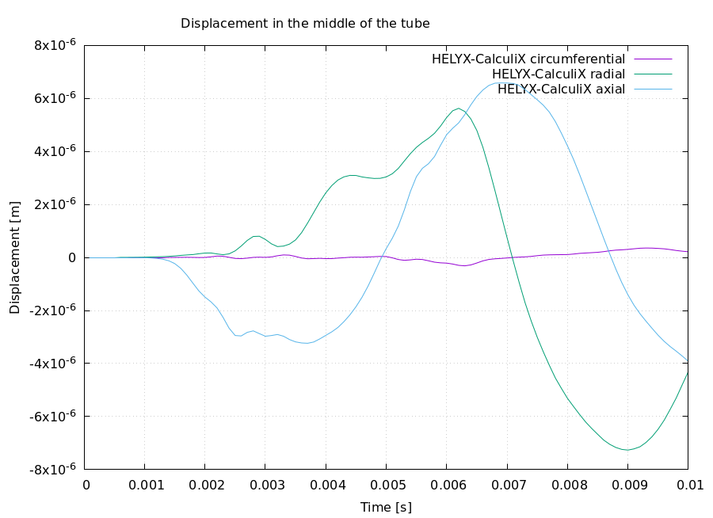

# Elastic tube 3D

**Summary:** Tutorial for an FSI simulation of a three-dimensional expanding tube scenario.

This fluid-structure interaction (FSI) example case is simulated by coupling a fluid solver (the rhieChowFlowSolver in HELYX) with a solid stucture solver (CalculiX), using the preCICE open-source coupling library to do the coupling. In order to run the example case, you need to have, in addition to HELYX, both [preCICE](https://precice.org/installation-overview.html) and [CalculiX with the preCICE CalculiX adapter](https://precice.org/adapter-calculix-overview.html) installed on your system. preCICE is available as part of the HELYX third-party directory, but CalculiX with
preCICE must be obtained separarately.

## Setup

The expanding tube test case involves a cylindrical fluid domain surrounded by a solid domain. A pressure inlet boundary condition is applied at the inlet for 3 milliseconds, and then set to zero for a further 7 milliseconds. The pressure of the fluid expands the tube which then relaxes once the pressure decreases.

The expanding tube test case comes with the interface surface mesh connectivity of the solid domain. This allows the use of nearest-projection mapping of the displacements of the solid domain. In order to run the example with nearest projection mapping, the "node-mesh-with-connectivity" has been specified in the `solid/config.yml` file. More details can be found in the [CalculiX configuration description](https://www.precice.org/adapter-calculix-config.html#nearest-projection-mapping).

## Available solvers

Fluid participant:

* HELYX (rhieChowFlowSolver with preciceAdapter in helyxSolve).

Solid participant:

* CalculiX. For more information, have a look at the [CalculiX adapter documentation](https://www.precice.org/adapter-calculix-overview.html).

## Running the simulation

You can start the simulation by running the script `./Allrun`. This will start both fluid and solid solvers.

## Post-processing

You can visualize the results using paraView or `cgx`(for native CalculiX result files), as usual. The total deformation is rather small. Multiplying the deformation by factor of 10 (warp by vector filter in paraView) and visualizing the fluid domain at `t=0.005s` looks as follows:

You can also plot the displacement of the midpoint of the tube by running `./plot-displacement.sh`. The displacement plot for each solver combination looks like:

## Acknowledgement

This example case is based on the elastic-tube-3d tutorial case for coupling OpenFOAM and CalculiX using preCICE. The original [OpenFOAM-CaluliX coupling case files are here](https://github.com/precice/tutorials/tree/master/elastic-tube-3d). For more information about the original case, read the [preCICE tutorials introduction](https://www.precice.org/tutorials.html).